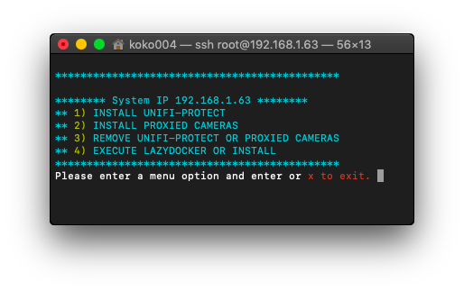

[](https://discord.gg/Bxk9uGT6MW)

UniFi Camera Proxy Automated Install
====================================



## This REPO

This script is made for a fast install and reinstall Non Unifi Cameras in Unifi Protect Instance. 

App is constructed by keshavdv you can visit his repository here: https://github.com/keshavdv/unifi-cam-proxy 

I only made an automated script for install, reinstall, remove cameras creating cert, docker image, mac and Unifi-Protect instace.

## Fast Init

1. First run Unifi-Protect installer then add Camera and select G3 Micro cam, follow instructions and capture QR generated to image file.

2. Upload the QR captured to https://zxing.org and copy 4 line, this is the TOKEN and you need paste it in this script when asked for TOKEN. 

3. Then you can run cam installer, it will ask you for 3 questions:

* 1. IP of UNIFI-PROTECT machine
* 2. TOKEN (previously created and convert)
* 3. RTSP address for the camera

This script is made for 3 cams you can install 1, 2 or 3 at same time.

NOTE: You can use same QR for all cameras.
You can change MACs from entrypoint.sh files.

```
git clone https://github.com/koko004/unifi-cam-proxy-automated-installer
cd unifi-cam-proxy-automated-installer
chmod +x automated-installer-unfi-cam-proxy.sh
./automated-installer-unfi-cam-proxy.sh
```

## About

This script is made from work of keshavdv you can visit his repository here: https://github.com/keshavdv/unifi-cam-proxy

This enables using non-Ubiquiti cameras within the UniFi Protect ecosystem. This is
particularly useful to use existing RTSP-enabled cameras in the same UI and
mobile app as your other Unifi devices.

## Documentation

View the documentation at https://unifi-cam-proxy.com

## Donations

If you would like to make a donation to support development, please use [Github Sponsors](https://github.com/sponsors/keshavdv).
